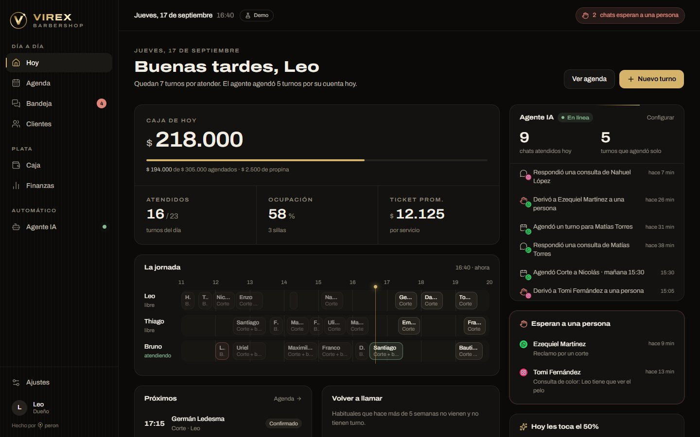
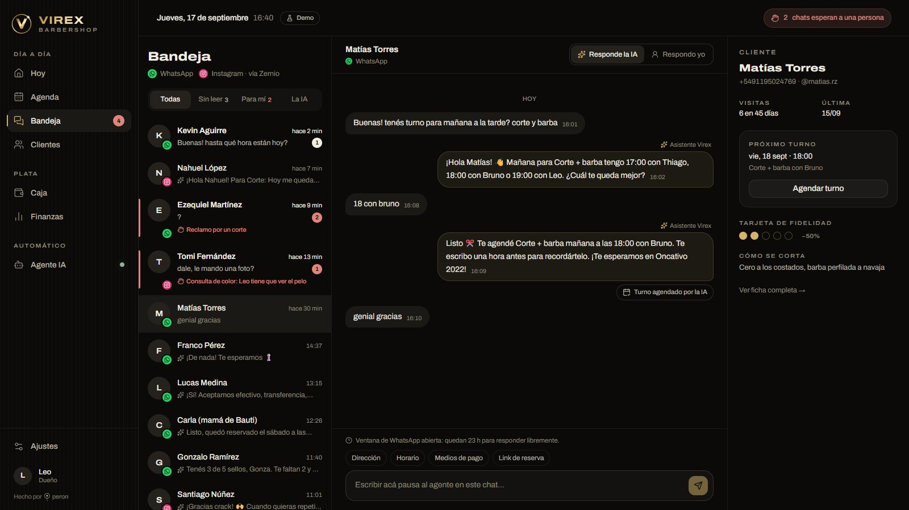
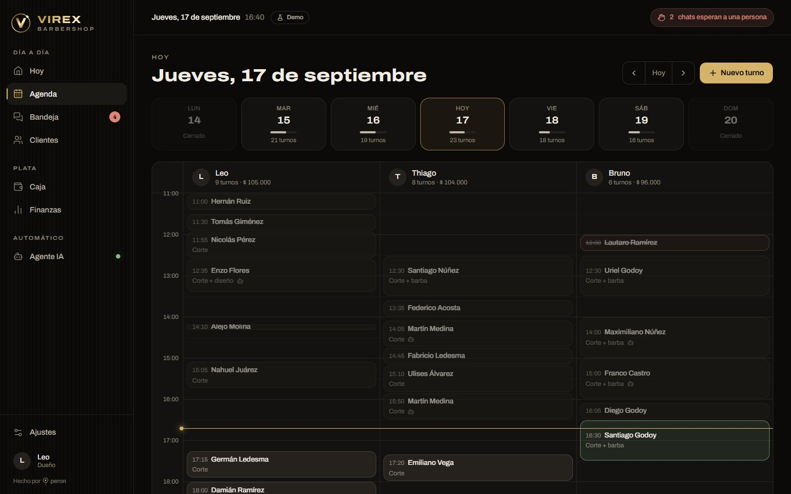
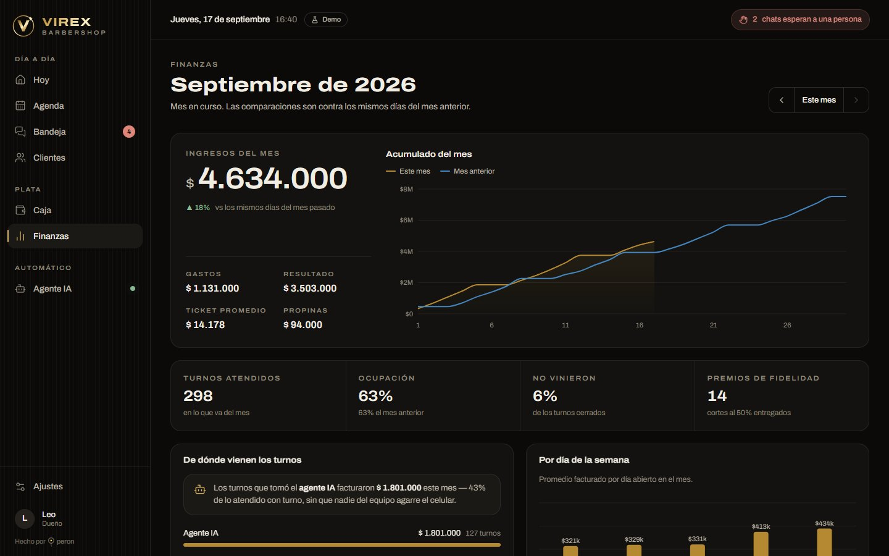
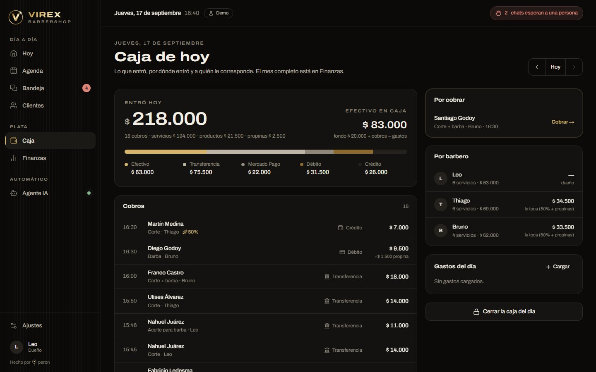
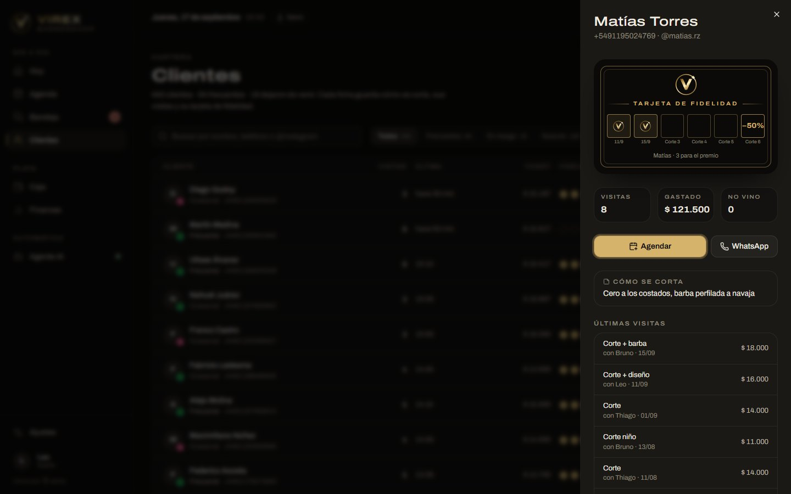
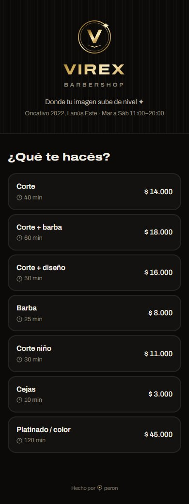

# Virex · Panel

**Panel de gestión para [Virex Barber Shop](https://www.instagram.com/virex_barbershop/)**
(Oncativo 2022, Lanús Este): agenda por barbero, bandeja unificada de WhatsApp e Instagram
vía Zernio, **agente IA que responde y agenda turnos solo**, caja del día, finanzas del mes,
clientes con tarjeta de fidelidad digital y reserva online pública.


> **Estado:** esqueleto funcional en **modo demo**. Todas las pantallas andan con datos de
> ejemplo realistas generados en memoria; la base (Supabase) y Zernio están diseñados y
> listos para conectar. Plan por fases y preguntas abiertas: [`docs/PLAN.md`](docs/PLAN.md).
> Guía para agentes (Codex / Claude Code): [`AGENTS.md`](AGENTS.md).

## Qué hace

| Pantalla | Para qué |
|---|---|
| **Hoy** | La que queda abierta todo el día: caja del día, ocupación, "La jornada" (un carril por barbero con la línea del ahora), próximos turnos, a quién le toca el 50 %, habituales a recontactar y el agente trabajando en vivo. |
| **Agenda** | Día por barbero y semana con ocupación. Tocar un hueco agenda ahí; cada turno pasa por confirmar → empezar → cobrar. |
| **Bandeja** | WhatsApp + Instagram juntos. Por conversación: "Responde la IA" o "Respondo yo". Las derivaciones del agente quedan en rojo; aviso de la ventana de 24 h de WhatsApp; respuestas rápidas; ficha del cliente al costado. |
| **Clientes** | Segmentos (frecuente / en riesgo / nuevo), notas de corte, historial y la **tarjeta de fidelidad digital**, réplica de la física que ya entregan (5 cortes → el 6to al 50 %). |
| **Caja** | Lo que entró por medio de pago, efectivo esperado, por cobrar, liquidación por barbero (comisión + propinas), gastos y cierre de caja. El 50 % de fidelidad se aplica solo al cobrar. |
| **Finanzas** | El mes contra los mismos días del anterior, por barbero, servicio, medio de pago y día de la semana, gastos, y **cuánto facturó lo que agendó el agente**. |
| **Agente IA** | Activar/pausar, tono, canales, permisos, reglas del dueño y un **chat de prueba con el agente real** (agenda de verdad). |
| **/reservar** | Página pública mobile-first para la bio de Instagram: servicio → horario → datos → confirmado. |

<table>
<tr><td></td><td></td></tr>
<tr><td align="center">Hoy</td><td align="center">Bandeja</td></tr>
<tr><td></td><td></td></tr>
<tr><td align="center">Agenda</td><td align="center">Finanzas</td></tr>
<tr><td></td><td></td></tr>
<tr><td align="center">Caja</td><td align="center">Ficha del cliente y tarjeta de fidelidad</td></tr>
</table>

<p align="center"></p>

## Cómo funciona el agente

```
WhatsApp / Instagram
        │
     Zernio ──webhook firmado──▶ /api/zernio/webhook ──▶ base (mensaje)
        ▲                               │ after(): se responde 200 al toque
        │                               ▼
        └──── sendMessage ◀──── agente (IA + herramientas) ──▶ agenda
```

- **Proveedor intercambiable:** Gemini 3.5 Flash-Lite por defecto (centavos por mes) o
  Claude Haiku 4.5, con `AGENT_PROVIDER` / `AGENT_MODEL`, sin tocar código.
- **7 herramientas** con esquema estricto: consultar disponibilidad, crear / reprogramar /
  cancelar turno, ver los turnos del cliente, consultar la tarjeta de fidelidad y derivar a una
  persona. **El modelo propone, el código decide:** cada herramienta revalida permisos, que el
  horario esté libre y que el turno sea del cliente que escribe.
- **Nada de doble turno:** la app sugiere horarios con una única función compartida por el
  agente, el panel y la reserva web; la base lo garantiza con una restricción `EXCLUDE`.
- **Nunca un cliente sin respuesta y sin nadie avisado:** si el agente falla, la conversación
  pasa a una persona y queda marcada en rojo.
- Prompt dividido en una parte fija y cacheable (negocio, servicios, reglas del dueño) y el
  contexto que cambia (fecha, hora, ficha del cliente) al final.

## Identidad

Sale del logo real (negro + oro metálico, medido sobre la foto de perfil de Instagram) y del
local (paredes de listones negros, líneas de LED en el techo).

- **Paleta:** obsidiana `#0B0A09`, marfil `#F2EDE3`, oro `#D6B36A`. El oro está reservado para
  la acción principal, el "ahora" y la fidelidad. Contrastes AA verificados; los gráficos usan
  una paleta de datos validada para daltonismo.
- **Tipografía:** una sola familia, Archivo, jugando con su eje de ancho: los títulos al
  125 % replican el wordmark extendido del logo.
- **Isotipo:** doble anillo, la V, el ala de debajo de BARBERSHOP y el destello ✦.
- **Intro (~1,4 s, una vez por sesión, se saltea con un toque):** se prenden las líneas de LED,
  se dibuja el anillo, aparece la V y la marca vuela a su lugar en el menú.

## Correr

```bash
npm install
cp .env.example .env.local   # opcional: GEMINI_API_KEY para probar el agente
npm run dev                  # http://localhost:3060
```

- `http://localhost:3060/?intro` fuerza la animación de entrada.
- `http://localhost:3060/reservar` es la reserva pública.
- Con el local cerrado (domingo, de noche) la demo simula una tarde de trabajo y lo avisa con
  la etiqueta **Demo**. `DEMO_CLOCK=real` lo desactiva.

| Comando | Qué hace |
|---|---|
| `npm run dev` | Servidor de desarrollo (puerto 3060) |
| `npm run build` | Build de producción (cortar `dev` antes: el build pisa `.next/`) |
| `npm test` | Tests de dominio: disponibilidad y fidelidad |
| `npm run test:db` | Corre la migración en Postgres real (PGlite) y prueba el anti doble turno |
| `npm run lint` | ESLint + React Compiler |

Scripts de verificación con Playwright (usan el Chrome instalado) en [`scripts/`](scripts/).

## Stack

Next.js 16 (App Router, Turbopack) · React 19 · TypeScript · Tailwind CSS v4 · shadcn/ui
(Base UI) + Magic UI · Recharts · `@google/genai` + `@anthropic-ai/sdk` · Zernio · Supabase (Postgres + RLS,
esquema listo) · Vitest · PGlite · Playwright.

## Estructura

```
src/
  app/(panel)/          Hoy · Agenda · Bandeja · Clientes · Caja · Finanzas · Agente · Ajustes
  app/reservar/         Reserva online pública
  app/api/zernio/       Webhook de mensajes entrantes (firma HMAC, dedupe, after())
  components/brand/     Isotipo, wordmark, intro, íconos de canal, sello Operon
  config/brand.ts       Datos del negocio (dirección, horario, fidelidad)
  lib/domain/           Reglas puras con tests: disponibilidad, fidelidad, finanzas
  lib/data/             Repositorio (hoy: estado demo en memoria), consultas y server actions
  lib/agent/            Agente IA: prompt, herramientas, loop con Claude, orquestación
  lib/zernio/           Cliente de Zernio (portado de operon-crm, probado en producción)
supabase/migrations/    Esquema completo con RLS y restricción anti doble turno
docs/PLAN.md            Fases hasta producción, costos y preguntas para el cliente
```

## Origen

Arrancó sobre [jlucasacosta/sistemas-barberias](https://github.com/jlucasacosta/sistemas-barberias)
(MIT, ver [`LICENSE`](LICENSE)): se tomó su mapa de módulos (agenda, reservas,
conversaciones, agente, métricas, pagos) y su flujo de reserva, y se reescribió sobre
Next.js 16 para tener servidor (webhooks, agente, pagos). Su commit inicial queda en el
historial.

---

Hecho por [Operon](https://operonhub.com/).
